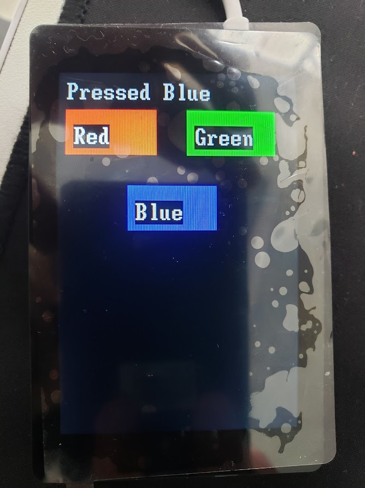

# WT32-SC01 Plus

The WT32-SC01 Plus is a smart, touch-enabled 3.5-inch LCD display module powered by an ESP32-S3 microcontroller, designed for rapid prototyping and IoT applications. This module supports various interfaces, including debug, extended IO, speaker, SD card, LCD, and RS485, making it ideal for complex embedded systems and UI-based applications.

- **Product Page:** [WT32-SC01 Plus](https://uelectronics.com/producto/wt32-sc01-plus-esp32-con-pantalla-tactil-3-5-320x480/)

---

## Firmware Update

To update the firmware, follow the instructions provided in the [WT32-SC01 firmware guide](./firmware/INS.md).

## Pinout

Refer to the pinout diagram below for easy reference to all available pins on the WT32-SC01 Plus module.


---

## Interface Description

### 1. Debug Interface

| Pin  | Description | Module Pin | Voltage Range | Remark                       |
|------|-------------|------------|---------------|------------------------------|
| 1    | +5V         | -          | 5V            |                              |
| 2    | +3.3V       | -          | 3.3V          | For reference, not for power input |
| 3    | ESP_TXD     | TXD0       | 3.3V TTL      |                              |
| 4    | ESP_RXD     | RXD0       | 3.3V TTL      |                              |
| 5    | EN          | EN         | 0-3.3V        | Chip enable                  |
| 6    | BOOT        | GPIO 0     | 0-3.3V        |                              |
| 7    | GND         | GND        | 0V            | Ground                       |

### 2. Extended IO Interface

| Pin  | Description | Module Pin | Voltage Range | Remark                       |
|------|-------------|------------|---------------|------------------------------|
| 1    | +5V         | -          | 5V ±5%        | Power supply or output voltage |
| 2    | GND         | -          | 0V            | Ground                       |
| 3    | EXT_IO1     | GPIO 10    | 0-3.3V        | Extended IO                  |
| 4    | EXT_IO2     | GPIO 11    | 0-3.3V        |                              |
| 5    | EXT_IO3     | GPIO 12    | 0-3.3V        |                              |
| 6    | EXT_IO4     | GPIO 13    | 0-3.3V        |                              |
| 7    | EXT_IO5     | GPIO 14    | 0-3.3V        |                              |
| 8    | EXT_IO6     | GPIO 21    | 0-3.3V        |                              |

### 3. Speaker Interface

| Pin | Description       | Remark             |
|-----|-------------------|--------------------|
| 1   | SPK+             | Speaker positive   |
| 2   | SPK-             | Speaker negative   |

### 4. SD Card Interface

| Description     | Module Pin | Remark                   |
|-----------------|------------|--------------------------|
| SD_CS           | GPIO 41    | SD card chip selection   |
| SD_DI (MOSI)    | GPIO 40    | SD card data input       |
| SD_CLK          | GPIO 39    | SD card clock            |
| SD_DO (MISO)    | GPIO 38    | SD card data output      |

### 5. LCD Interface

| Description     | Module Pin | Remark                   |
|-----------------|------------|--------------------------|
| BL_PWM          | GPIO 45    | Backlight control, active high |
| LCD_RESET       | GPIO 4     | LCD reset, multiplexed with touch reset |
| LCD_RS          | GPIO 0     | Command/Data selection   |
| LCD_WR          | GPIO 47    | Write clock              |
| LCD_TE          | GPIO 48    | Frame sync               |
| LCD_DB0         | GPIO 9     | LCD data interface, 8bit MCU (8080) |
| LCD_DB1         | GPIO 46    |                          |
| LCD_DB2         | GPIO 3     |                          |
| LCD_DB3         | GPIO 8     |                          |
| LCD_DB4         | GPIO 18    |                          |
| LCD_DB5         | GPIO 17    |                          |
| LCD_DB6         | GPIO 16    |                          |
| LCD_DB7         | GPIO 15    |                          |
| TP_INT          | GPIO 7     | Touch interrupt          |
| TP_SDA          | GPIO 6     | Touch IIC data           |
| TP_SCL          | GPIO 5     | Touch IIC clock          |
| TP_RST          | GPIO 4     | Touch reset, multiplexed with LCD reset |

### 6. RS485 Interface

| Pin | Description | Remark                  |
|-----|-------------|-------------------------|
| 1   | RS485-A     | RS485 bus               |
| 2   | RS485-B     | SD card data input      |
| 3   | GND         | Ground                  |
| 4   | +5V         | Power supply or output voltage |

---

## Example Integration

Below is an example code for integrating the WT32-SC01 Plus module with a touch controller and displaying interactive buttons on the screen. This code initializes the I2C connection for the FT6336U touch controller, sets up an interactive UI with three color buttons, and handles touch events without redrawing the background.

```python
from machine import I2C, Pin, freq
from time import sleep
from uFT6336U import FT6336U
import wt32sc01py as wt32
import vga2_bold_16x32 as font

# Set processor frequency
freq(240_000_000)

# Initialize I2C and touch controller
def init_touch_controller():
    for attempt in range(3):
        try:
            i2c = I2C(1, scl=Pin(5), sda=Pin(6), freq=400000)
            i2c_devices = i2c.scan()
            if 0x38 in i2c_devices:
                return FT6336U(i2c)
        except Exception:
            pass
        sleep(0.05)
    return None

# Initialize display and touch controller
touch = init_touch_controller()
tft = wt32.WT32SC01(0)
tft.clear()

# Define buttons
buttons = [
    {"label": "Red", "x": 10, "y": 50, "width": 120, "height": 60, "color": wt32.color565(255, 0, 0)},
    {"label": "Green", "x": 170, "y": 50, "width": 120, "height": 60, "color": wt32.color565(0, 255, 0)},
    {"label": "Blue", "x": 90, "y": 150, "width": 120, "height": 60, "color": wt32.color565(0, 0, 255)}
]

# Draw buttons on screen
def draw_buttons():
    for button in buttons:
        tft.fill_rect(button["x"], button["y"], button["width"], button["height"], button["color"])
        tft.text(font, button["label"], button["x"] + 10, button["y"] + 20, wt32.color565(255, 255, 255))

# Check if touch position is on a button
def get_button_at(x, y):
    for button in buttons:
        if button["x"] <= x <= button["x"] + button["width"] and button["y"] <= y <= button["y"] + button["height"]:
            return button
    return None

# Handle touch event on a button without redrawing the background
def handle_touch(button):
    tft.fill_rect(0, 0, tft.width, 40, wt32.color565(0, 0, 0))  # Clear text area only
    tft.text(font, f"Pressed {button['label']}", 10, 10, wt32.color565(255, 255, 255))  # Show message

# Main touch detection function
def main():
    global touch
    last_button = None  # Last button pressed
    draw_buttons()
    while True:
        if touch:
            try:
                points = touch.get_positions()
                if points:
                    x, y = points[0]
                    button = get_button_at(x, y)
                    # Avoid redrawing if the same button is pressed
                    if button and button != last_button:
                        handle_touch(button)
                        last_button = button
                else:
                    last_button = None
            except OSError:
                touch = init_touch_controller()
        else:
            touch = init_touch_controller()
        sleep(0.01)

main()
```


The following code snippet demonstrates the result of the code on the WT32-SC01 Plus module using the wt32sc01py and uFT6336U libraries.




This layout includes the example code and the image showing the result of the integration on the WT32-SC01 Plus module.


## Additional Resources

- **GitHub Repositories:**
  - [russhughes/wt32sc01py](https://github.com/russhughes/wt32sc01py)
  - [russhughes/s3lcd](https://github.com/russhughes/s3lcd/tree/main)
  - [fantasticdonkey/uFT6336U](https://github.com/fantasticdonkey/uFT6336U/tree/master)
