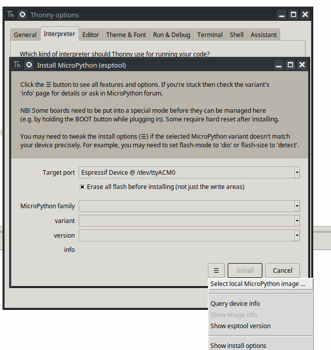
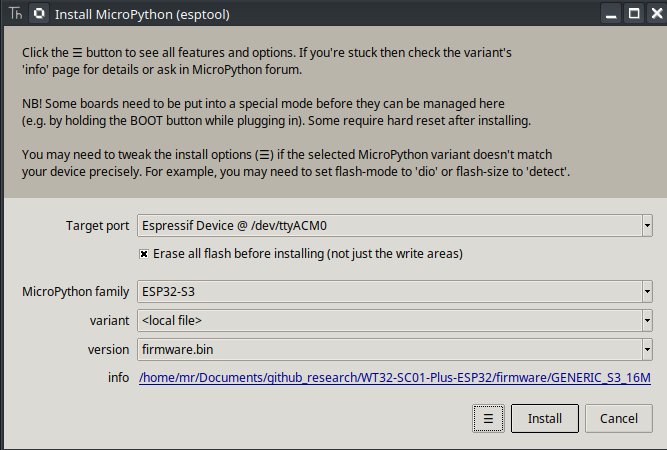

# Installation

Follow these steps to install the firmware on the WT32-SC01 module.

### 1. Download the Firmware

Download the firmware from the following link:

- [firmware](./GENERIC_S3_16M/firmware.bin)

### 2. Connect the WT32-SC01 Module

Connect the WT32-SC01 module to your computer using a USB to serial adapter.

> **Note:** Boot mode is entered by holding the **BOOT** button while pressing the **RESET** button. 

### 3. Flash Using Thonny

Use Thonny to flash the firmware.

---

## Additional Resources

The firmware was designed by [russhughes](https://github.com/russhughes/s3lcd/tree/main/firmware/GENERIC_S3_OCT_16M).

### Main Library

You can find the main library here:

- [wt32sc01py.py](https://github.com/russhughes/wt32sc01py/blob/main/lib/wt32sc01py.py)
